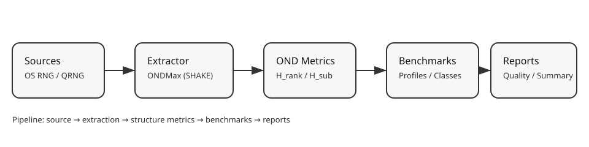

# OND Random: производственная витрина исследовательского RNG‑стека

**Дистрибутив / репозиторий:**  
https://github.com/miroaleksej/OND-Random/tree/main

---

Если коротко: **OND Random** — это готовый инженерный стек для измерения и улучшения качества случайности. Он связывает источник энтропии, экстрактор, структурные метрики и отчёты в один воспроизводимый pipeline. Это полезно там, где важно не просто «случайно», а **понятно и проверяемо**.

---

## Что даёт OND Random

**1) Контроль качества случайности**  
Система измеряет структуру через OND‑метрики (H_rank, H_sub, H_branch). Это позволяет видеть реальные отклонения от IID и объяснять их, а не просто фиксировать «тест не пройден».

**2) Строгую экстракцию**  
ONDMaxRNG (SHAKE256) работает как конденсатор структуры и выравнивает выход по качеству. Это не «магия», а строгая криптографическая обработка входной энтропии.

**3) Полный отчётный контур**  
От профилирования до отчётов: автоматические бенчмарки, сводки, quality‑checks и pipeline, которые воспроизводятся одной командой.

**4) Квантовый блок**  
Встроены statevector, Lindblad и trajectories, плюс демонстрации Grover/Shor — удобно для исследований, сравнений и методологии.

---

## Как выглядит pipeline



---

## Быстрый старт (3 команды)

```bash
ond-random gen --rng ondmax --bits 256 --hex
ond-random profile --rng quantum --samples 10000 --dimension 4 --word-bits 32 --modulus --auto-calibrate
PYTHONPATH=. python scripts/run_pipeline.py --samples 10000 --dimension 4 --word-bits 32 --branch-mode delta
```

**Что вы получаете:**
- готовые отчёты качества;
- диагностику структуры;
- сравнение источников;
- сводку по системе.

---

## Ключевые возможности (по делу)

- **OND‑метрики** на сырых данных (без нормализации).  
- **Автокалибровка по источнику** (разные калибровки под разные RNG).  
- **Benchmark‑наборы** и воспроизводимые отчёты.  
- **Квантовые модели**: statevector/Lindblad/trajectories.  
- **Grover/Shor** как контрольные квантовые задачи.  

---

## Иллюстрации

**Сходимость по шагу dt (Euler vs RK4 vs аналитика):**  


**Скан по gamma1 (RK4 vs аналитика):**  


---

## Для кого это

- для инженеров RNG и криптографов, которым важна **структура**;
- для исследователей, которые хотят связать «источник → качество → метрики»;
- для тех, кто экспериментирует с квантовой эмуляцией;
- для R&D‑команд, которым нужна воспроизводимость и отчётность.

---

## Честная позиция

OND Random — это **диагностика и улучшение качества**. Это не замена стандартам NIST, а дополнительный слой измеримости и контроля. Если нужны формальные сертификации — они делаются поверх, но система уже готова к этому этапу.

---

Если нужна отдельная версия статьи под аудит безопасности, стандарты или коммерческую презентацию — сделаю.
